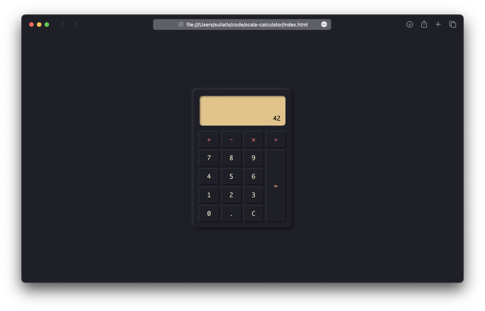

# Scala Calculator

A simple calculator app built with Scala JS and Tyrian.

## Getting Started

- Use the `make ide` task to generate the bsp & lsp files for your ide
- Start start live compilation with the `make live` task
- Open the `index.html` with your favorite browser

## Inspiration

I took [Not Your Usual Calculator by theteachr](https://github.com/theteachr/nyu-calculator) as an inspiration, but used Scala JS and Tyrian (an Elm like framework for Scala JS) to build my version.

## Goals

This project is the part of my ongoing experimentation to:
- build web apps with Scala JS and Tyrian
- reduce tooling boiolerplate with scala-cli and make
- develop a style of coding similar to Elm

